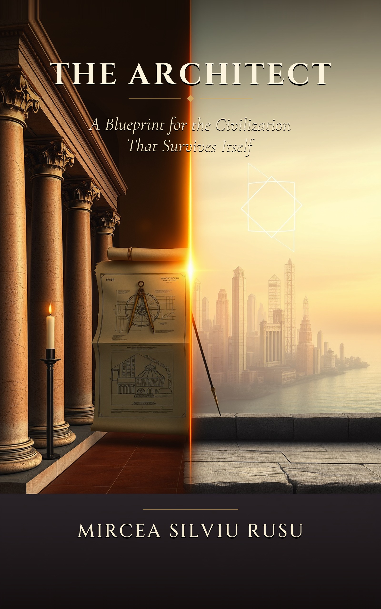
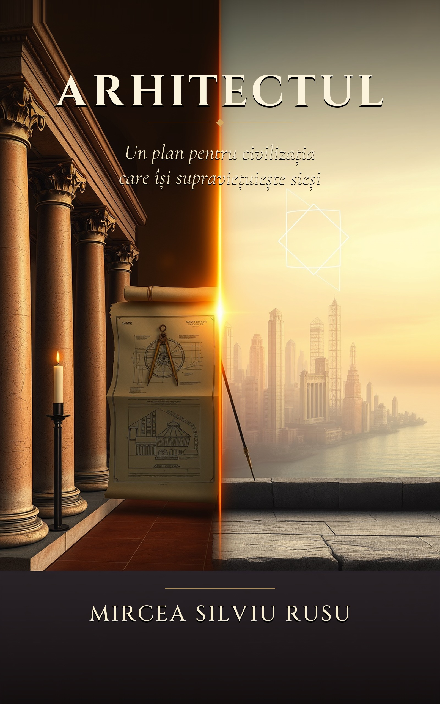

# The Architect — Book

**A Blueprint for the Civilization That Survives Itself**

*by Mircea S. Rusu · First Edition · 2026*

---

<table>
<tr>
<td width="50%" align="center">
  <a href="en/the-architect.html">
    
  </a>
  <br /><br />
  <strong>English Edition</strong><br />
  <a href="en/the-architect.pdf">📥 Download PDF</a> &nbsp;·&nbsp;
  <a href="en/the-architect.html">🌐 Read Online (HTML)</a><br />
  <a href="en/the-architect-sampler.pdf">📄 Free Sampler (PDF)</a>
</td>
<td width="50%" align="center">
  <a href="ro/arhitectul.html">
    
  </a>
  <br /><br />
  <strong>Ediția în Română</strong><br />
  <a href="ro/arhitectul.pdf">📥 Descarcă PDF</a> &nbsp;·&nbsp;
  <a href="ro/arhitectul.html">🌐 Citește Online (HTML)</a><br />
  <a href="ro/arhitectul-sampler.pdf">📄 Sampler Gratuit (PDF)</a>
</td>
</tr>
</table>

---

## About the Book

Every civilization is, in the end, a piece of code.

Not in the narrow sense of machines and silicon, but in the older and more durable sense: a set of rules executed by a population, day after day, until the rules become indistinguishable from reality.

The civilization we have inherited is running on code written, for the most part, between the seventeenth and the mid-twentieth century. These were brilliant pieces of design. They achieved exactly what they were built to achieve. The argument is not contempt for the builders of the old code. The argument is that the code worked — and that the world it was written for no longer exists.

**The Architect** does not stop at diagnosis. It moves to the engineering question:

> *If the operating system is obsolete, what would a new one actually look like?*

Not in metaphor. Not in vision. In architecture — with named components, named interfaces, named failure modes, and named transitions from the present arrangement to the proposed one.

---

## Contents

- **Part One** — The Diagnosis: five failures of trust, distribution, work, law, and foresight
- **Part Two** — Seven Principles: the foundations any successor system must satisfy
- **Part Three** — The Constitutional Text: a founding document any community on Earth may join
- **Part Four** — The Architecture: public ledger, governance layer, AI authority, identity, economy, labor, law
- **Part Five** — The Transition: moving from today to the proposed system without civil war
- **Part Six** — What Comes After: what becomes possible once the operating system is not the bottleneck

---

## Repository Structure

```
book/
├── assets/
│   ├── cover-en.jpg          English edition cover
│   └── cover-ro.jpg          Romanian edition cover
├── en/
│   ├── the-architect.html    Full book — English (single-file, readable offline)
│   ├── the-architect.pdf     Print-ready PDF — English
│   └── the-architect-sampler.pdf   Free sampler — first two chapters
└── ro/
    ├── arhitectul.html       Carte completă — Română (fișier unic, offline)
    ├── arhitectul.pdf        PDF pregătit pentru tipar — Română
    └── arhitectul-sampler.pdf      Sampler gratuit — primele două capitole
```

---

## Platform

This repository also contains the implementation of the governance platform described in the book — a working prototype of the architecture proposed in Part Four.

→ [Back to platform README](../README.md)

---

*© 2026 Mircea S. Rusu. All rights reserved.*
